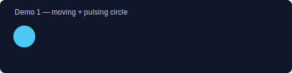
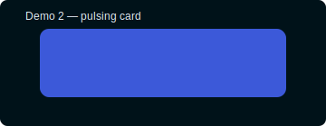
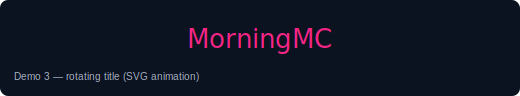

# MorningMC.qzz.io

<style>
	/* Lightweight in-readme animations for local renderers */
	.mc-banner{display:flex;align-items:center;gap:16px}
	.mc-bounce{animation:mc-bounce 2s infinite;display:inline-block}
	@keyframes mc-bounce{0%{transform:translateY(0)}50%{transform:translateY(-8px)}100%{transform:translateY(0)}}
	.mc-rainbow{background:linear-gradient(90deg,#f72585,#b5179e,#7209b7,#4361ee,#4cc9f0);-webkit-background-clip:text;background-clip:text;color:transparent;animation:mc-shift 4s linear infinite}
	@keyframes mc-shift{0%{background-position:0%}100%{background-position:200%}}
	.mc-glow{filter:drop-shadow(0 4px 8px rgba(67,97,238,0.35))}
</style>

<div class="mc-banner">
	<div style="font-size:40px" class="mc-bounce">☕️</div>
	<div>
		<h1 class="mc-rainbow mc-glow">MorningMC.qzz.io</h1>
		<div style="opacity:0.9">A tiny, delightful collection of pages, assets and experiments — built for curiosity.</div>
	</div>
</div>

## What this repo is

- **Interactive mini-site**: several small pages including `index.html`, `projects.html`, `utils.html`, and `videos.html` showcasing tiny front-end experiments.
- **Assets**: fonts, hosted media, and scripts under `assets/` (images, styles, scripts).
- **Design playground**: CSS experiments in `assets/styles/` and script helpers in `assets/scripts/`.

## Highlights (with live-style snippets)

- Animated banner: the header above uses inline CSS animations to give the repo personality.
- Tiny utilities: `assets/scripts/common.js` and `auto-expand.js` contain small helpers for page behavior.
- Hosted examples: `assets/hosted/` holds a few sample files and models used on experimental pages.

## Pages

- Home: [index.html](index.html)
- Projects: [projects.html](projects.html)
- Utilities: [utils.html](utils.html)
- Videos & demos: [videos.html](videos.html)
- Debug playground: [debug.html](debug.html)

## Run locally

Use a simple local static server to preview everything (works on macOS, Linux, Windows):

```bash
# Python 3 built-in server
python3 -m http.server 8000

# Or use npm http-server (if you have Node.js installed)
npx http-server -c-1 . 8000
```

Open http://localhost:8000 in your browser.

## Contributing & experiments

- Want to try a tweak? Open one of the `.html` pages and edit `assets/styles/` or `assets/scripts/`.
- Add an animated demo GIF to `assets/images/` and reference it from the pages to make demos pop.

## Fun, interactive README elements

This README supports small inline HTML/CSS animations in local renderers (like VS Code's preview). Examples above include a bouncing coffee emoji and a rainbow-shift title. You can paste additional snippets below to preview more effects:

<div style="display:flex;gap:12px;align-items:center;margin-top:12px">
	<div style="width:56px;height:56px;border-radius:10px;background:#4361ee;color:white;display:flex;align-items:center;justify-content:center;font-weight:700;animation:spin 8s linear infinite">MC</div>
	<div style="padding:8px;border-radius:8px;background:linear-gradient(180deg,#ffffff0f,#00000008);">Try editing <strong>index.html</strong> and refresh to see changes.</div>
</div>

<style>@keyframes spin{0%{transform:rotate(0)}100%{transform:rotate(360deg)}}</style>

## Tech & credits

- Vanilla HTML/CSS/JS — no build step required.
- Inspired by tiny front-end experiments and playful UI micro-interactions.

## Next steps (ideas)

1. Add GIF demos to `assets/images/` for each experiment.
2. Create a small `README-assets` folder with animated previews.
3. Deploy to GitHub Pages or any static host for shareable demos.

Enjoy exploring — drop ideas or files and I'll help wire them into the site!

---
_Generated: a friendly, animated README to match the repo's playful content._

## Demo previews

Quick, in-repo previews were added so you can see small animated experiments directly in this project. Open the files in a browser or preview them in VS Code.

- Demo 1: moving + pulsing circle — [assets/images/demo1.svg](assets/images/demo1.svg)
- Demo 2: pulsing card — [assets/images/demo2.svg](assets/images/demo2.svg)
- Demo 3: rotating title — [assets/images/demo3.svg](assets/images/demo3.svg)

Inline previews (open in a Markdown/SVG-aware viewer):





If you'd like real GIF files instead of animated SVGs, I can generate lightweight GIFs and place them in `assets/images/` — tell me the desired sizes and loop settings.

GIF previews were generated and saved in `assets/images/`:

- Demo 1 GIF: [assets/images/demo1.gif](assets/images/demo1.gif)
- Demo 2 GIF: [assets/images/demo2.gif](assets/images/demo2.gif)
- Demo 3 GIF: [assets/images/demo3.gif](assets/images/demo3.gif)

Inline GIF previews (may autoplay in some viewers):


